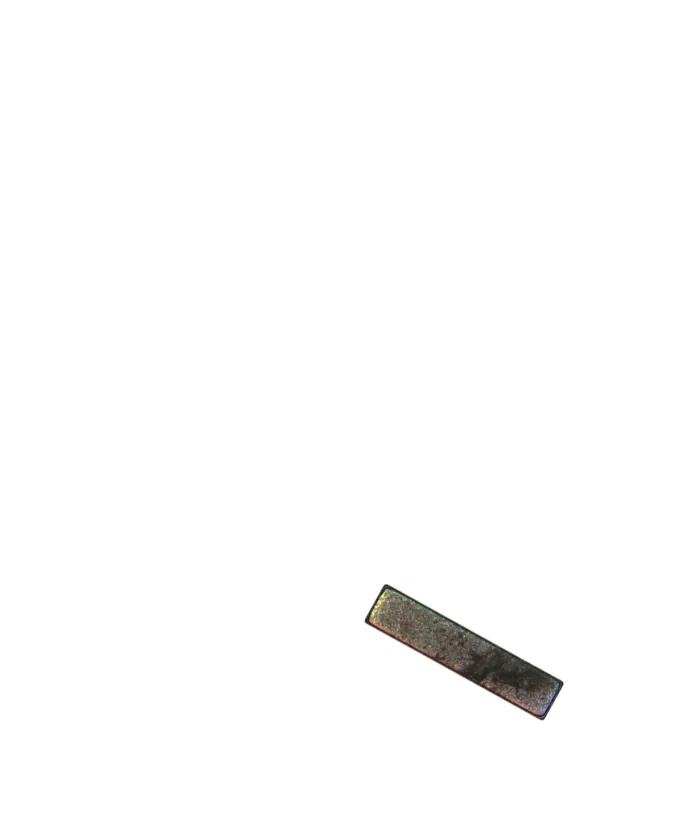
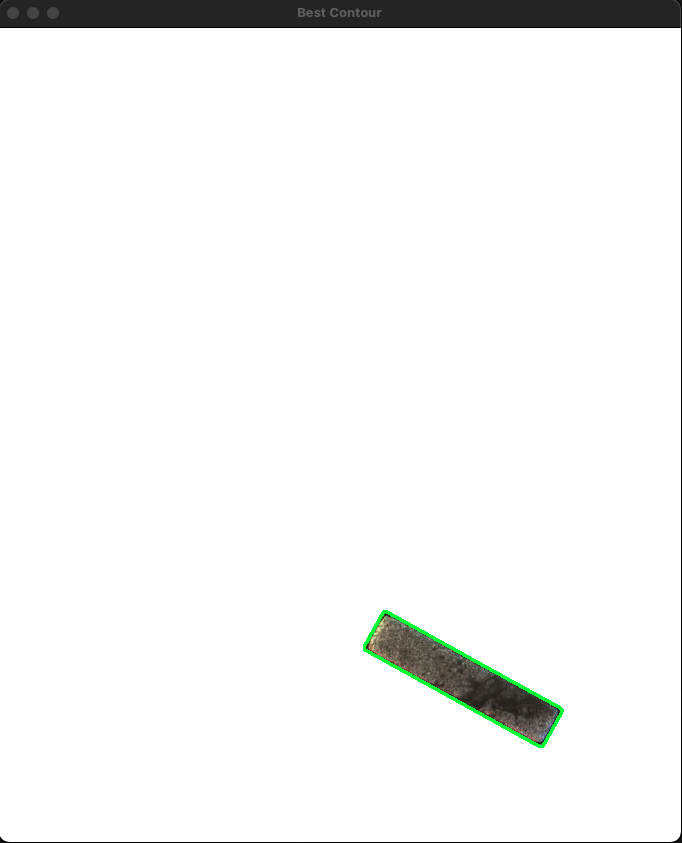
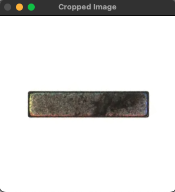

# Rust OpenCV Object Detection

### Prerequisites
* OpenCV 
`brew install opencv`
* llvm
`brew install llvm`
* adjust '~/.bash_profile' to include the following (for Apple Silicon):
```
export PATH="/opt/homebrew/opt/llvm/bin:$PATH"
export LDFLAGS="-L/opt/homebrew/opt/llvm/lib"
export CPPFLAGS="-I/opt/homebrew/opt/llvm/include"
```

### Usage
Adjust parameters in `src/main.rs` for x,y, width and height; then `cargo run`

### Example
#### Input


#### Output

